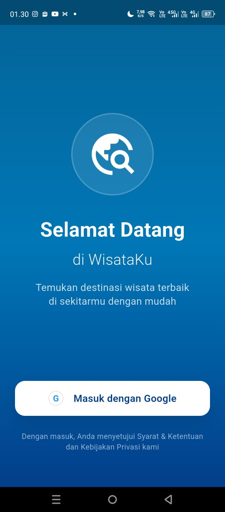
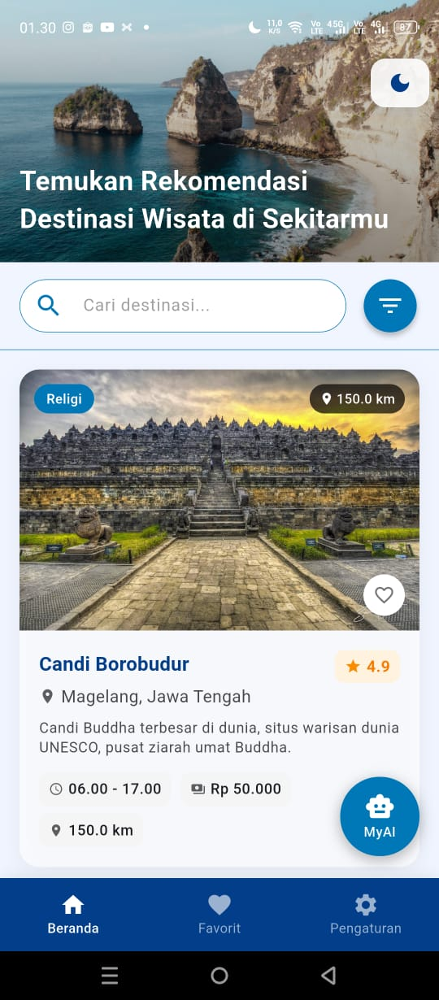
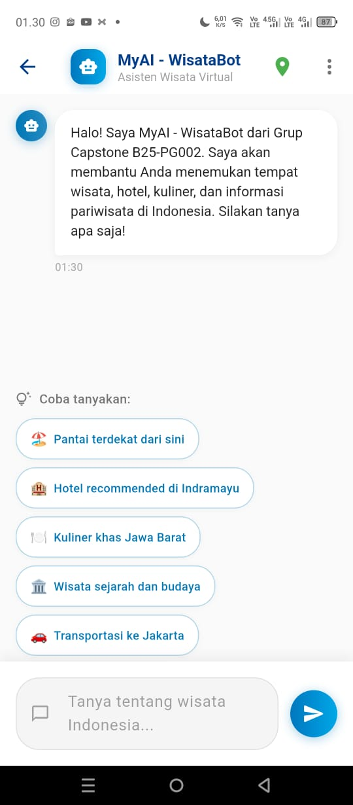
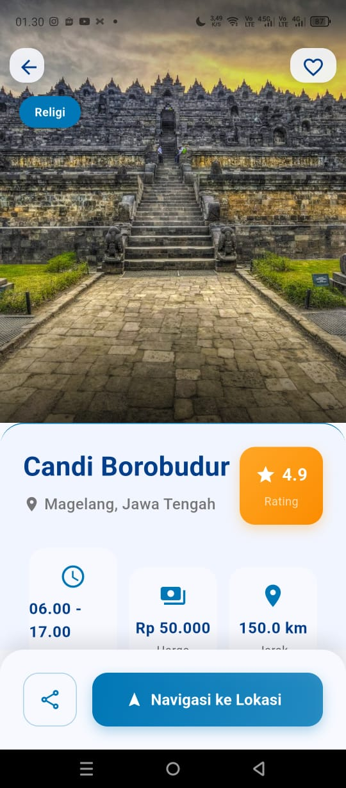
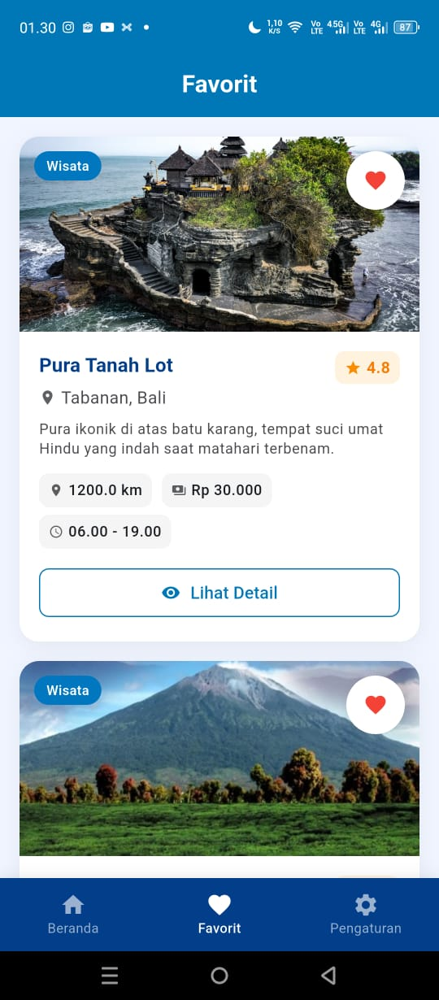

# WisataKu

<div align="center">

**Aplikasi Perencanaan Wisata Pintar Berbasis AI**

Capstone Project - BEKUP CREATE 2025 (Upskilling Multi-Platform App Developer)

[Fitur](#fitur-utama) • [Instalasi](#instalasi) • [Teknologi](#teknologi) • [Kontribusi](#kontribusi)

</div>

---

## Tentang Proyek

**WisataKu** adalah aplikasi mobile berbasis **Flutter** yang dirancang untuk menyederhanakan perencanaan perjalanan wisata di Indonesia. Aplikasi ini menyediakan informasi destinasi yang akurat dan dilengkapi dengan **chatbot interaktif berbasis AI (Google Gemini API)** yang mampu menjawab pertanyaan pengguna serta memberikan rekomendasi wisata berbasis lokasi secara real-time.

---

## Fitur Utama

### Autentikasi Google
Login yang aman dan mudah menggunakan **Firebase Auth** & **Google Sign-In**, tanpa perlu membuat akun baru.

### AI Chatbot (Gemini)
Chatbot interaktif yang didukung oleh **Google Gemini API** untuk menjawab pertanyaan terkait wisata secara natural dan cerdas.

### Rekomendasi Berbasis Lokasi
Dapatkan rekomendasi wisata yang dipersonalisasi berdasarkan **lokasi Anda saat ini** menggunakan teknologi geolocation.

### Detail Destinasi Lengkap
Tampilan UI yang bersih dan informatif menampilkan:
- Deskripsi lengkap destinasi
- Jam operasional
- Harga tiket masuk
- Fasilitas yang tersedia
- Rating dan ulasan

### Daftar Favorit
Simpan destinasi favorit Anda untuk akses cepat dan mudah di kemudian hari.

### Tema Dinamis
Mendukung **Light Mode** dan **Dark Mode** yang dapat disesuaikan dengan preferensi pengguna.

---

## Tampilan Aplikasi

<table>
  <tr>
    <td align="center"><b>Login</b></td>
    <td align="center"><b>Home</b></td>
    <td align="center"><b>Chatbot</b></td>
  </tr>
  <tr>
    <td></td>
    <td></td>
    <td></td>
  </tr>
</table>

<table>
  <tr>
    <td align="center"><b>Detail Destinasi</b></td>
    <td align="center"><b>Favorit</b></td>
    <td align="center"><b>Pengaturan</b></td>
  </tr>
  <tr>
    <td></td>
    <td></td>
    <td></td>
  </tr>
</table>

---

## Teknologi

### Core Framework & Libraries

| Kategori | Teknologi |
|----------|-----------|
| **Framework** | Flutter SDK 3.x |
| **State Management** | Provider |
| **Backend & Database** | Firebase (Core, Auth, Firestore) |
| **AI Engine** | Google Gemini API |
| **Autentikasi** | Google Sign-In |
| **Local Storage** | Shared Preferences |
| **Geolocation** | Geolocator, Permission Handler |
| **Environment Variables** | Envied |
| **Markdown Renderer** | Flutter Markdown Plus |

### Arsitektur
- **MVVM Pattern** untuk pemisahan logic dan UI
- **Provider** untuk state management yang efisien
- **Clean Architecture** untuk kode yang maintainable

---

## Instalasi

### Prasyarat

Pastikan Anda telah menginstal:

- **Flutter SDK** (versi 3.x atau lebih baru)
- **Dart** (included dengan Flutter)
- **Android Studio** atau **VS Code** dengan Flutter extension
- **Git**
- Akun **Firebase** aktif
- **Google Gemini API Key**

---

### Langkah-Langkah Instalasi

#### 1. Clone Repository

```bash
git clone https://github.com/anggiimaulana/capstone-bekup-2025.git
cd capstone-bekup-2025
```

#### 2. Konfigurasi Firebase

1. Buka [Firebase Console](https://console.firebase.google.com/)
2. Buat project baru atau gunakan yang sudah ada
3. Tambahkan aplikasi Android:
   - Unduh `google-services.json`
   - Letakkan di `android/app/`
4. Tambahkan aplikasi iOS:
   - Unduh `GoogleService-Info.plist`
   - Letakkan di `ios/Runner/`
5. Aktifkan **Google Sign-In**:
   - Buka **Authentication** → **Sign-in method**
   - Enable **Google**
6. Buat **Firestore Database**:
   - Pilih mode **test** atau **production** sesuai kebutuhan

#### 3. Setup Google Gemini API

1. Dapatkan API Key dari [Google AI Studio](https://makersuite.google.com/app/apikey)
2. Buat file `.env` di root project:

```env
GEMINI_API_KEY=YOUR_GEMINI_API_KEY_HERE
```

**Penting:** Jangan commit file `.env` ke repository!

#### 4. Konfigurasi Permission Lokasi

**Android** - Tambahkan di `android/app/src/main/AndroidManifest.xml`:

```xml
<uses-permission android:name="android.permission.ACCESS_FINE_LOCATION" />
<uses-permission android:name="android.permission.ACCESS_COARSE_LOCATION" />
```

**iOS** - Tambahkan di `ios/Runner/Info.plist`:

```xml
<key>NSLocationWhenInUseUsageDescription</key>
<string>Aplikasi ini membutuhkan akses lokasi untuk memberikan rekomendasi wisata yang dipersonalisasi.</string>
<key>NSLocationAlwaysUsageDescription</key>
<string>Aplikasi ini membutuhkan akses lokasi untuk memberikan rekomendasi wisata yang dipersonalisasi.</string>
```

#### 5. Generate Environment Files

```bash
flutter pub run build_runner build --delete-conflicting-outputs
```

#### 6. Install Dependencies

```bash
flutter pub get
```

#### 7. Jalankan Aplikasi

```bash
# Untuk Android
flutter run

# Untuk iOS (hanya di macOS)
flutter run -d ios

# Untuk Web (jika dikembangkan)
flutter run -d chrome
```

---

## Struktur Proyek

```
lib/
├── env/                     # Environment configuration
├── model/                   # Data models (Destination, User, dll)
├── provider/                # State management dengan Provider
├── screen/                  # UI screens (Home, Detail, Chatbot, dll)
├── service/                 # API services (Firebase, Gemini)
├── style/                   # Theme & styling configuration
├── utils/                   # Helper functions & constants
├── widget/                  # Reusable custom widgets
├── firebase_options.dart    # Firebase configuration
├── main.dart               # Entry point aplikasi
└── splash_screen.dart      # Splash screen
```

---

## Environment Variables

Buat file `.env` di root project dan tambahkan:

```env
GEMINI_API_KEY=your_gemini_api_key_here
```

Pastikan file `.env` sudah ditambahkan ke `.gitignore`:

```gitignore
# Environment
.env
*.env
```

---


## Pengembang

Dikembangkan oleh **Grup Capstone B25-PG002**

**Capstone Project** - BEKUP CREATE 2025 (Upskilling Multi-Platform App Developer)

---

## Kontak

Untuk pertanyaan atau saran, silakan hubungi:
- GitHub: [@anggiimaulana](https://github.com/anggiimaulana)
- Email: anggimaulana23@student.polindra.ac.id

---

<div align="center">

**Jika project ini bermanfaat, berikan bintang!**

Made with Flutter

</div>
